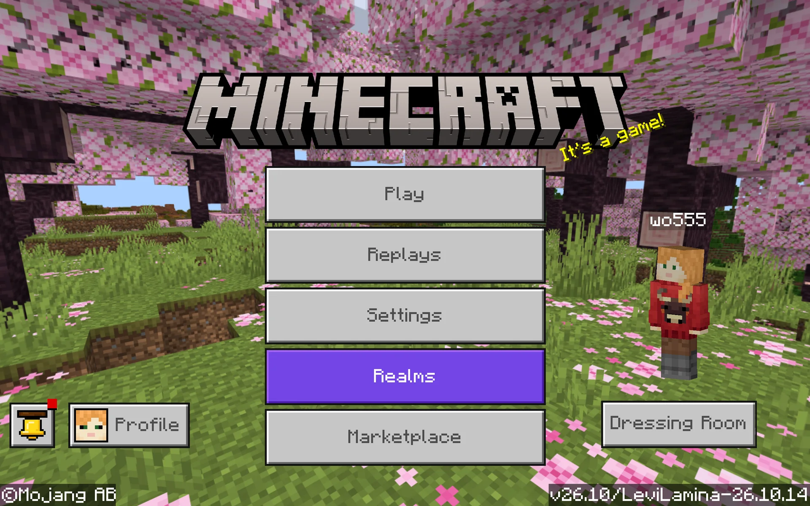
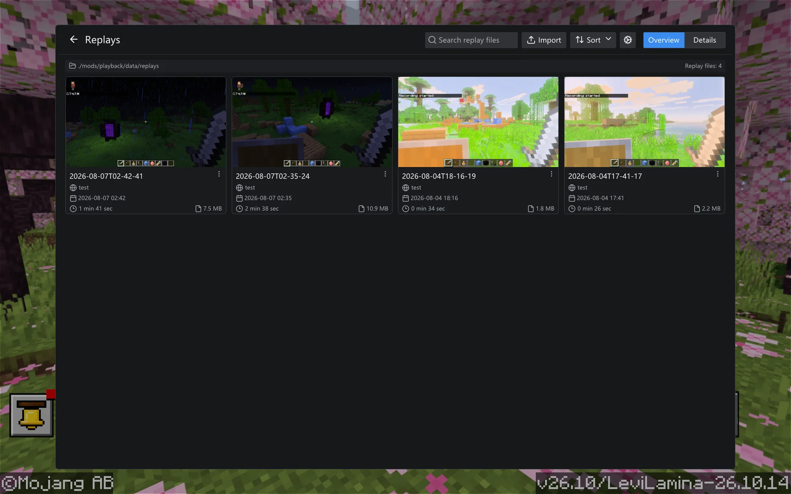

  
  <h1>Playback</h1>
  
<strong>Record, revisit, and replay Minecraft Bedrock.</strong>

  
A native LeviLamina client mod for recording, exporting, and replaying your sessions.

  

    <a href="docs/getting-started.md">Get started</a>
    ·
    <a href="https://github.com/wo55555/Playback/releases">Releases</a>
    ·
    <a href="CHANGELOG.md">Changelog</a>
    ·
    <a href="https://github.com/wo55555/Playback/issues">Report an issue</a>
    ·
    <a href="CONTRIBUTING.md">Contributing</a>
    ·
    <a href="#contributing">Contributing</a>
    .
    <a href="#code-of-conduct">Code of Conduct</a>
    <a href="README_ZH.md">简体中文</a>
  

  

    
    
  

> [!WARNING]
> Playback is still in an early stage of development. All currently published releases are test builds. Keep backups of important worlds and recordings; replay compatibility is not guaranteed across Minecraft, LeviLamina, or Playback version changes.

## Quick Start

> [!IMPORTANT]
> Use a clean LeviLamina client instance when possible. Broad compatibility with other mods is not currently guaranteed.

1. Create or select a clean LeviLamina client instance for the target Minecraft version.
2. Install the matching Playback `#client` release through LeviLauncher/Lip or from the release ZIP.
3. Launch the game, record with `record start` / `record pause` / `record stop`, then open the exported replay from the main-menu **Playback** browser.

See the [installation and usage guide](docs/getting-started.md) for screenshots, exact Lip commands, manual installation, recording, and replay instructions.

## Showcase

  <strong>Main menu integration</strong> 
  

  <strong>Native replay browser</strong> 
  

  <strong>In-game timeline editor</strong> 
  

> [!NOTE]
> The UI is still under active development, and the current interface does not represent the final design.

## Features

- **Session capture** — Records loaded chunks, block actors, entity movement, player state, time, and selected client-safe game packets.
- **Low-impact recording** — Writes replay snapshots and timeline data asynchronously to reduce recording stalls.
- **Portable archives** — Exports recordings as replay files that are easy to store and share.
- **Isolated playback** — Opens recordings from a native main-menu browser in a dedicated local replay world.
- **Replay browser** — Searches, imports, filters, sorts, renames, deletes, and opens replay files, with grid and list views.
- **Replay thumbnails** — Captures a preview image during recording when the game is in a menu-free state.
- **Timeline controls** — Supports play, pause, seek, speed control, and quick navigation during replay.
- **Timeline editor** — Provides zoomable tracks, resizable panels, camera/sequence/entity-segment editing, and undo/redo for the active in-memory project.
- **Bilingual UI** — Localizes commands, the native replay UI, and the resource-pack main-menu button in English and Simplified Chinese.

## Latest Changes

`v0.1.2` expands the native replay browser, adds replay thumbnails, rebuilds the in-game timeline editor, unifies user-facing i18n, and reduces the legacy UI resource pack to the main-menu button.

> [!CAUTION]
> This release changes the replay snapshot format. Replays created by `v0.1.1` or earlier must be recorded again. The internal `Config` version remains at its initial value (`1`), third-party dependency versions remain unchanged, and no migration is provided.

> [!IMPORTANT]
> The **Playback** main-menu button still uses a lightweight UI resource pack. Complete Lip and release-ZIP installations include it under `mods/playback/resource_packs/playback-ui/`; the Release also provides `playback-ui.mcpack` for standalone manual import.

See the full [changelog](CHANGELOG.md) for release history and detailed changes.

## Compatibility

Playback maintains release lines for different Minecraft and LeviLamina versions. This release targets `26.10.*`; use the listed `26.20.*` release until a compatible `v0.1.2` build is published for that runtime.

| Minecraft / LeviLamina | Playback release | Status |
| --- | --- | --- |
| `26.10.*` | [`v0.1.2-mc26.10`](https://github.com/wo55555/Playback/releases/tag/v0.1.2-mc26.10) | Maintained |
| `26.20.*` | [`v0.1.1-mc26.20`](https://github.com/wo55555/Playback/releases/tag/v0.1.1-mc26.20) | Maintained |

Both release lines target Minecraft Bedrock for Windows x64 and are distributed as client-only mods.

> [!TIP]
> Playback is a client-only mod that can record sessions in both local worlds and multiplayer servers.

## Build From Source

Playback builds on Windows x64 with Visual Studio 2022, xmake, and Git. See the [source-build guide](docs/building.md) for clean Release commands, output layout, and dependency troubleshooting.

## Commands

| Command | Description |
| --- | --- |
| `playback version` | Show the loaded Playback version. |
| `record start` | Start or resume recording the current world. |
| `record pause` | Pause the active recording. |
| `record stop` | Stop recording and export the replay. |

## Languages

Playback currently includes English (`en_US`) and Simplified Chinese (`zh_CN`) translations stored in `src/lang/`.

## Development Status and Roadmap

- The recording, export, and replay GUIs are under active development and optimization.
- Multiplayer server recording and replay will receive further debugging; testing and feedback are welcome.
- Planned features include video rendering and video export.

> [!TIP]
> **Coming next:** The next release will bring a major UI update and optimization pass, along with the first camera features.

## Known Limitations

- The replay format is still under development and may change during Alpha releases.
- Playback reconstructs recorded client-visible state; it is not a deterministic copy of the original server simulation.
- Pending scheduled ticks and server-owned systems such as villages, raids, and POI state are not currently persisted as authoritative simulation state.
- Editor changes currently live in memory; project persistence and video export are not available yet.
- Compatibility must be checked again after updating Minecraft or LeviLamina.

Please report reproducible problems with logs, versions, and a minimal replay where possible.

[Open an issue](https://github.com/wo55555/Playback/issues) to report a reproducible problem.

## Contributing

See the [source-build guide](docs/building.md) and [CONTRIBUTING.md](CONTRIBUTING.md) for the build, formatting, and pull request workflow.

Please read and follow our [Code of Conduct](CODE_OF_CONDUCT.md). By participating in this project, you agree to abide by its terms.

Report security issues privately by following [SECURITY.md](SECURITY.md). Do not open a public issue for a security vulnerability.

## Code of Conduct

Playback follows the Contributor Covenant Code of Conduct. Please read [CODE_OF_CONDUCT.md](CODE_OF_CONDUCT.md) before participating in issues, pull requests, discussions, or community spaces.

## Acknowledgements

Special thanks to the [LeviLamina](https://github.com/LiteLDev/LeviLamina) maintainers and community for providing the native modding platform and tooling that make Playback possible, and to the [Flashback](https://github.com/Moulberry/Flashback) project and its contributors for the replay concepts and architecture that inspired Playback.

## License

Copyright (C) 2026 [wo555](https://github.com/wo55555)

Playback is released under the [GNU Affero General Public License v3.0](LICENSE). Distributed modifications must remain under AGPL-3.0 and provide their corresponding source code. Third-party components retain their own licenses; see [THIRD_PARTY_NOTICES.md](THIRD_PARTY_NOTICES.md) and the `licenses/` directory.
