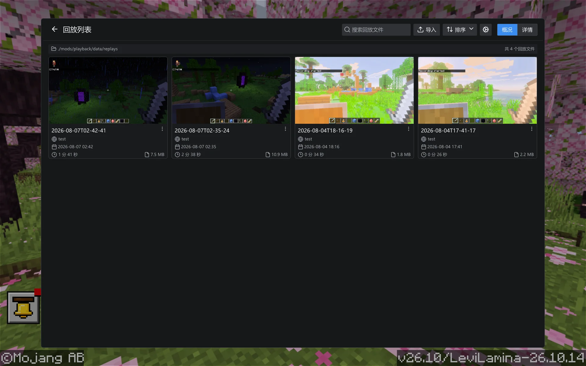
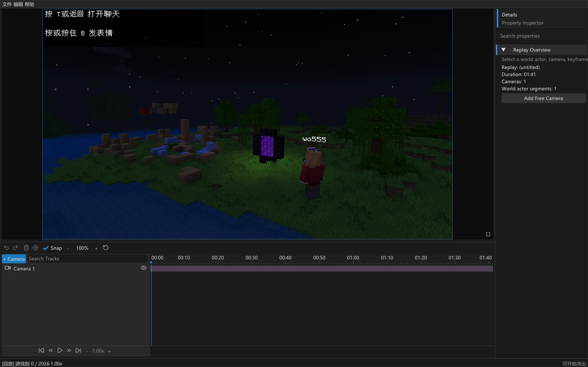

  
  <h1>Playback</h1>
  
<strong>录下此刻，再现世界。</strong>

  
用于录制、导出和回放 Minecraft 基岩版游戏过程的 LeviLamina 客户端原生模组。

  

    <a href="docs/getting-started.zh-CN.md">开始使用</a>
    ·
    <a href="https://github.com/wo55555/Playback/releases">发行版本</a>
    ·
    <a href="CHANGELOG.md">更新日志</a>
    ·
    <a href="https://github.com/wo55555/Playback/issues">问题反馈</a>
    ·
    <a href="#兼容性">兼容性</a>
    ·
    <a href="#从源码构建">从源码构建</a>
    ·
    <a href="#参与贡献">参与贡献</a>
    ·
    <a href="#行为准则">行为准则</a>
    <a href="CONTRIBUTING.md">参与贡献</a>
    ·
    <a href="README.md">English</a>
  

  

    
    
  

> [!WARNING]
> Playback 目前仍处于早期开发阶段，现有公开版本均为测试版本。请备份重要世界和录制文件；在 Minecraft、LeviLamina 或 Playback 版本发生变化后，不保证旧回放仍然兼容。

## 快速开始

> [!IMPORTANT]
> 建议尽量使用干净的 LeviLamina 客户端实例；目前不保证与其他模组广泛兼容。

1. 为目标 Minecraft 版本创建或选择干净的 LeviLamina 客户端实例。
2. 通过 LeviLauncher/Lip 或发行压缩包安装匹配的 Playback `#client` 版本。
3. 启动游戏，使用 `record start` / `record pause` / `record stop` 录制，然后从主菜单的 **Playback** 浏览器打开导出的回放。

截图、完整 Lip 命令、手动安装以及录制回放说明见 [安装与使用指南](docs/getting-started.zh-CN.md)。

## 运行展示

  <strong>主菜单入口</strong> 
  

  <strong>原生回放浏览器</strong> 
  

  <strong>游戏内时间线编辑器</strong> 
  

> [!NOTE]
> 目前的 UI 仍在积极开发中，当前 UI 界面不代表最终效果。

## 功能

* **游戏录制** — 捕获已加载区块、方块实体、实体移动、玩家状态、时间和经过筛选的客户端安全数据包。
* **低开销写入** — 异步写入回放快照和时间线数据，减少录制过程中的卡顿。
* **便携归档** — 将录制结果导出为便于保存和分享的回放文件。
* **隔离回放** — 通过原生主菜单回放浏览器，在独立的本地回放世界中打开录制内容。
* **回放浏览器** — 支持搜索、导入、筛选、排序、重命名、删除和打开回放，并提供平铺与列表视图。
* **回放缩略图** — 在游戏未打开菜单时尝试为录制内容捕获预览图。
* **时间线控制** — 支持播放、暂停、跳转、倍速调整和快速定位。
* **时间线编辑器** — 提供可缩放轨道、可调整面板、相机/序列/实体片段编辑，以及当前内存项目的撤销与重做。
* **双语界面** — 为命令、原生回放界面和资源包主菜单按钮提供英文及简体中文本地化。

## 本版更新

`v0.1.2` 扩展了原生回放浏览器，加入回放缩略图，重构了游戏内时间线编辑器，统一了用户界面的国际化文本，并将旧 UI 资源包精简为仅保留主菜单按钮。

> [!CAUTION]
> 本次更新修改了回放快照格式，使用 `v0.1.1` 或更早版本创建的回放必须重新录制。代码中的 `Config` 版本保持初始值（`1`），第三方依赖版本保持不变，不提供迁移逻辑。

> [!IMPORTANT]
> 主菜单中的 **Playback** 按钮仍依赖轻量 UI 资源包。通过 Lip 或完整 Release ZIP 安装时，资源包会放入 `mods/playback/resource_packs/playback-ui/`；Release 同时提供 `playback-ui.mcpack` 供单独手动导入。

完整发行历史与详细变更见 [更新日志](CHANGELOG.md)。

## 兼容性

Playback 针对不同 Minecraft 与 LeviLamina 版本维护发行版本。本次发行面向 `26.10.*`；在针对 `26.20.*` 的兼容 `v0.1.2` 构建发布前，请继续使用下表列出的版本。

| Minecraft / LeviLamina | Playback 版本                                                                         | 状态  |
| ---------------------- | ----------------------------------------------------------------------------------- | --- |
| `26.10.*`              | [`v0.1.2-mc26.10`](https://github.com/wo55555/Playback/releases/tag/v0.1.2-mc26.10) | 维护中 |
| `26.20.*`              | [`v0.1.1-mc26.20`](https://github.com/wo55555/Playback/releases/tag/v0.1.1-mc26.20) | 维护中 |

两个版本均面向 Windows x64 平台的 Minecraft 基岩版，并以纯客户端模组形式发布。

> [!TIP]
> Playback 为纯客户端模组，支持在本地世界和多人服务器中录制游戏过程。

## 从源码构建

Playback 使用 Visual Studio 2022、xmake 和 Git 在 Windows x64 上构建。干净 Release 构建命令、输出结构和依赖排错见 [源码构建指南](docs/building.zh-CN.md)。

## 命令

| 命令                 | 说明                   |
| ------------------ | -------------------- |
| `playback version` | 显示当前加载的 Playback 版本。 |
| `record start`     | 开始或继续录制当前世界。         |
| `record pause`     | 暂停当前录制。              |
| `record stop`      | 停止录制并导出回放。           |

## 语言

Playback 目前提供英文（`en_US`）和简体中文（`zh_CN`）翻译，翻译文件位于 `src/lang/`。

## 开发状态与计划

* 录制、导出和回放 GUI 正在持续构建与优化中。
* 后续将重点调试多人服务器会话的录制与回放，欢迎测试并反馈问题。
* 计划开发视频渲染与导出等功能。

> [!TIP]
> **下个版本预告：** 将继续进行 UI 界面的大更新与深度优化，并加入摄影机功能。

## 已知限制

* 回放格式仍在开发中，Alpha 版本之间可能发生变化。
* Playback 重建的是已录制的客户端可见状态，并不是原始服务器模拟过程的确定性副本。
* 当前不会将待处理的计划刻以及村庄、袭击、POI 等服务端系统保存为权威模拟状态。
* 编辑器修改目前只存在于内存中，项目持久化和视频导出尚未开放。
* Minecraft 或 LeviLamina 更新后，需要重新确认兼容性。

请尽量在报告可复现问题时附上日志、版本信息和最小回放文件。

[创建 Issue](https://github.com/wo55555/Playback/issues) 可用于报告可复现问题。

## 参与贡献

构建说明见 [源码构建指南](docs/building.zh-CN.md)，格式化和 Pull Request 流程见 [CONTRIBUTING.md](CONTRIBUTING.md)。

请阅读并遵守 [行为准则](CODE_OF_CONDUCT.md)。参与本项目即表示你同意遵守其中条款。

安全问题请按照 [SECURITY.md](SECURITY.md) 私下报告，不要为安全漏洞创建公开 Issue。

## 行为准则

Playback 采用 Contributor Covenant 行为准则。请在参与 Issue、Pull Request、Discussion 或社区空间之前阅读 [CODE_OF_CONDUCT.md](CODE_OF_CONDUCT.md)。

## 致谢

特别感谢 [LeviLamina](https://github.com/LiteLDev/LeviLamina) 的维护者与社区提供原生模组开发平台和工具，使 Playback 得以实现；同时感谢 [Flashback](https://github.com/Moulberry/Flashback) 项目及其贡献者，其回放理念与架构为 Playback 提供了重要启发。

## 许可证

Copyright (C) 2026 [wo555](https://github.com/wo55555)

Playback 采用 [GNU Affero 通用公共许可证 v3.0](LICENSE) 发布。分发修改版本时必须继续使用 AGPL-3.0，并提供对应源代码。第三方组件保留各自许可证，详情见 [THIRD_PARTY_NOTICES.md](THIRD_PARTY_NOTICES.md) 和 `licenses/` 目录。
