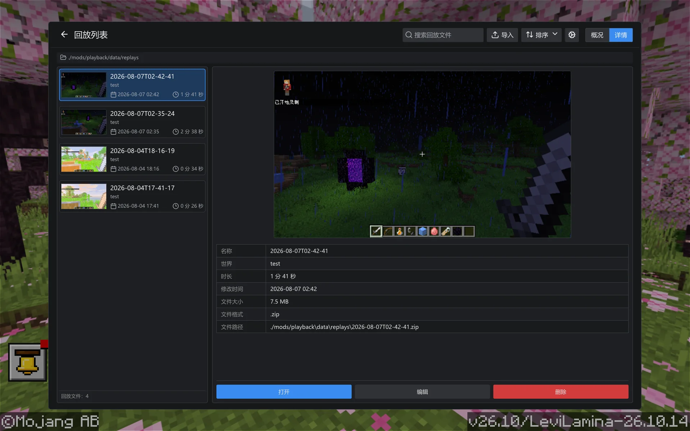

  
  <h1>Playback</h1>
  
<strong>录下此刻，再现世界。</strong>

  
面向 Windows LeviLamina 的开源 Minecraft 基岩版回放录制与电影相机编辑模组，并提供实验性视频导出。

  

    
    
    
    
  

  

    <a href="docs/getting-started.zh-CN.md">开始使用</a>
    ·
    <a href="https://github.com/wo55555/Playback/releases">发行版本</a>
    ·
    <a href="CHANGELOG.md">更新日志</a>
    ·
    <a href="https://github.com/wo55555/Playback/issues">问题反馈</a>
    ·
    <a href="CONTRIBUTING.md">参与贡献</a>
    ·
    <a href="#行为准则">行为准则</a>
    ·
    <a href="README.md">English</a>
  

  

    
    
  

> [!WARNING]
> Playback 目前仍处于早期开发阶段，现有公开版本均为测试版本。请备份重要世界和录制文件；在 Minecraft、LeviLamina 或 Playback 版本发生变化后，不保证旧回放仍然兼容。

Playback 将客户端可见的 Minecraft 基岩版游戏过程录制为便携回放文件，在隔离的本地回放世界中重建场景，并提供基于时间线的电影相机关键帧。当前还提供供测试使用的 MP4 和 PNG 序列导出。

## 快速开始

> [!IMPORTANT]
> 建议尽量使用干净的 LeviLamina 客户端实例；目前不保证与其他模组广泛兼容。

1. 为目标 Minecraft 版本创建或选择干净的 LeviLamina 客户端实例。
2. 通过 LeviLauncher/Lip 或发行压缩包安装匹配的 Playback `#client` 版本。
3. 启动游戏，使用 `record start` / `record pause` / `record stop` 录制，然后从主菜单的 **Playback** 浏览器打开导出的回放。

截图、完整 Lip 命令、手动安装以及录制回放说明见[安装与使用指南](docs/getting-started.zh-CN.md)。

## 运行展示

  <strong>主菜单入口</strong> 
  

  <strong>原生回放浏览器</strong> 
  

  <strong>回放预览与文件详情</strong> 
  

  <strong>游戏内时间线编辑器</strong> 
  

> [!NOTE]
> 目前的 UI 仍在积极开发中，当前 UI 界面不代表最终效果。

## Minecraft 基岩版回放与相机功能

- **游戏录制** — 捕获已加载区块、方块实体、实体移动、玩家状态、时间和经过筛选的客户端安全数据包。
- **多人服务器区块兼容** — 保留本地世界的区块处理方式，并针对采用其他区块传输方式的服务器，在客户端完成解码后录制可移植的回放数据。
- **低开销写入** — 异步写入回放快照和时间线数据，减少录制过程中的卡顿。
- **便携归档** — 将录制结果导出为便于保存和分享的回放文件。
- **隔离回放** — 通过原生主菜单回放浏览器，在独立的本地回放世界中打开录制内容。
- **回放浏览器** — 支持搜索、导入、筛选、排序、重命名、删除和打开回放，并提供平铺与列表视图。
- **回放缩略图** — 在游戏未打开菜单时尝试为录制内容捕获预览图。
- **时间线控制** — 支持播放、暂停、跳转、倍速调整和快速定位。
- **时间线编辑器** — 提供可缩放轨道、可调整面板、相机/序列/实体片段编辑，以及当前内存项目的撤销与重做。
- **电影相机关键帧** — 记录位置、偏航、俯仰、滚转和 FOV，并支持平滑、线性、缓入缓出、保持、Hermite 与三次贝塞尔插值。
- **维度感知相机路径** — 每次维度变化都会切断相机轨道，预览和导出不会在不同世界之间错误插值。
- **实验性视频导出** — 将指定 tick 区间渲染为 H.264 MP4 或 PNG 序列，可配置帧率、分辨率、SSAA 和预热帧。
- **D3D11 与 D3D12 采集** — 支持两种原生渲染后端；D3D12 支持稳定的 1x/2x SSAA，D3D11 使用 1x。
- **双语界面** — 为命令、原生回放界面和资源包主菜单按钮提供英文及简体中文本地化。

## 本版更新

`v0.2.0` 新增电影相机关键帧、维度感知预览、实验性 MP4/PNG 导出、D3D11/D3D12 采集、相机区域区块跟随，并完成大规模回放与编辑器架构整理。2026 年 8 月 20 日热更新进一步改进了多人服务器回放兼容性，保留自定义实体注册数据，使视频导出可在 Minecraft 窗口失焦时继续运行，并移除了可能导致有效导出卡在第 0 帧的固定相机邻域检查。

> [!CAUTION]
> Playback 当前发布的仍是测试版本，可能直接进行破坏性的格式或配置更新。旧版本创建的回放与 `v0.2.0-mc26.10` 不兼容，必须重新录制。受影响服务器在本次热更新前录制的回放可能已经缺少可移植区块或自定义实体注册数据，这类归档无法修复，也必须重新录制；数据完整的 `v0.2.0-mc26.10` 回放无需转换。配置版本和录制文件的快照上下文版本均保持为 `1`，不提供迁移层。

> [!IMPORTANT]
> 主菜单中的 **Playback** 按钮仍依赖轻量 UI 资源包。通过 Lip 或完整 Release ZIP 安装时，资源包会放入 `mods/playback/resource_packs/playback-ui/`；Release 同时提供 `playback-ui.mcpack` 供单独手动导入。

完整发行历史与详细变更见[更新日志](CHANGELOG.md)。

## 兼容性

Playback 针对不同 Minecraft 与 LeviLamina 版本维护独立发行线。产品版本 `0.2.0` 在当前分支发布为 `v0.2.0-mc26.10`；`26.20.*` 请使用下表对应的 MC 26.20 发行版本。

| Minecraft / LeviLamina | Playback 版本                                                                       | 状态       |
| ---------------------- | ----------------------------------------------------------------------------------- | ---------- |
| `26.10.*`              | [`v0.2.0-mc26.10`](https://github.com/wo55555/Playback/releases/tag/v0.2.0-mc26.10) | 当前测试版 |
| `26.20.*`              | [`v0.1.1-mc26.20`](https://github.com/wo55555/Playback/releases/tag/v0.1.1-mc26.20) | 维护中     |

两个版本均面向 Windows x64 平台的 Minecraft 基岩版，并以纯客户端模组形式发布。

> [!TIP]
> Playback 为纯客户端模组，支持在本地世界和多人服务器中录制游戏过程。

## 从源码构建

Playback 使用 Visual Studio 2022、xmake 和 Git 在 Windows x64 上构建。干净 Release 构建命令、输出结构和依赖排错见[源码构建指南](docs/building.zh-CN.md)。

## 命令

| 命令               | 说明                           |
| ------------------ | ------------------------------ |
| `playback version` | 显示当前加载的 Playback 版本。 |
| `record start`     | 开始或继续录制当前世界。       |
| `record pause`     | 暂停当前录制。                 |
| `record stop`      | 停止录制并导出回放。           |

## 语言

Playback 目前提供英文（`en_US`）和简体中文（`zh_CN`）翻译，翻译文件位于 `src/lang/`。

## 常见问题

### Playback 是什么？

Playback 是面向 Windows x64 LeviLamina 客户端的 Minecraft 基岩版回放录制与相机编辑模组。它会保存客户端可见的会话数据，并在独立的本地回放世界中重建。

### Playback 可以录制多人服务器吗？

可以。Playback 是纯客户端模组，可录制本地世界或多人会话中客户端实际看到的区块、实体和经过筛选的数据包。2026 年 8 月 20 日热更新改进了采用其他区块传输方式或自定义实体注册表的服务器录制；修复前从未保存的数据无法恢复，受影响的回放可能需要重新录制。

### Playback 可以将回放导出为视频吗？

`v0.2.0-mc26.10` 提供实验性的 H.264 MP4 和 PNG 序列导出。目前仍存在已知限制，并且不包含音频。

### 相机关键帧会跨维度插值吗？

不会。每次已录制的维度变化都会切断相机时间线，即使经过的中间维度没有相机关键帧也一样。

### 应该安装哪个 Playback 版本？

LeviLamina `26.10.*` 使用 `v0.2.0-mc26.10`。Minecraft/LeviLamina `26.20.*` 使用单独维护的对应发行线。

## 开发状态与计划

- 录制、回放、相机和导出工作流仍在持续构建与优化中。
- 后续将重点调试多人服务器会话的录制与回放，欢迎测试并反馈问题。
- 后续计划包括编辑项目持久化、音频导出、更广泛的渲染器兼容和更多相机工具。

> [!TIP]
> **测试重点：** 报告相机、跨维度、区块加载或导出问题时，请附上回放文件、日志、GPU、渲染后端和导出设置。

## 已知限制

- 回放格式仍在开发中，Alpha 版本之间可能发生变化。
- Playback 重建的是已录制的客户端可见状态，并不是原始服务器模拟过程的确定性副本。
- 当前不会将待处理的计划刻以及村庄、袭击、POI 等服务端系统保存为权威模拟状态。
- 编辑器修改目前只存在于内存中，不会在回放会话之间持久化。
- 实验性视频导出当前生成无音频的 H.264 MP4 或 PNG 序列，尚未实现音频导出，并且仍可能存在运行时问题。
- D3D12 的 SSAA 上限为 2x，D3D11 使用 1x。
- 相机只能渲染回放数据中实际存在的区块，无法重建从未录制的地形。
- 本次热更新无法追溯恢复现有回放归档中已经缺失的服务器区块或自定义实体注册数据。
- Minecraft 或 LeviLamina 更新后，需要重新确认兼容性。

报告可复现问题时，请尽量附带日志、相关版本和最小回放文件。

如需报告可复现问题，请[创建 Issue](https://github.com/wo55555/Playback/issues)。

## 参与贡献

构建说明见[源码构建指南](docs/building.zh-CN.md)，格式化和 Pull Request 流程见 [CONTRIBUTING.md](CONTRIBUTING.md)。

请阅读并遵守 [行为准则](CODE_OF_CONDUCT.md)。参与本项目即表示你同意遵守其中条款。

安全问题请按照 [SECURITY.md](SECURITY.md) 私下报告，不要为安全漏洞创建公开 Issue。

## 行为准则

Playback 采用 Contributor Covenant 行为准则。请在参与 Issue、Pull Request、Discussion 或社区空间之前阅读 [CODE_OF_CONDUCT.md](CODE_OF_CONDUCT.md)。

## 致谢

特别感谢 [LeviLamina](https://github.com/LiteLDev/LeviLamina) 的维护者与社区提供原生模组开发平台和工具，使 Playback 得以实现；同时感谢 [Flashback](https://github.com/Moulberry/Flashback) 项目及其贡献者，其回放理念与架构为 Playback 提供了重要启发。

## 许可证

Copyright (C) 2026 [wo555](https://github.com/wo55555)

Playback 采用 [GNU Affero 通用公共许可证 v3.0](LICENSE) 发布。分发修改版本时必须继续使用 AGPL-3.0，并提供对应源代码。第三方组件保留各自许可证，详情见 [THIRD_PARTY_NOTICES.md](THIRD_PARTY_NOTICES.md) 和 `licenses/` 目录。
